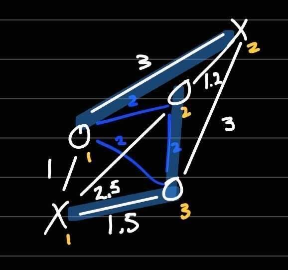

# Multi-Agent Case Swap

## Preliminary test scripts are saved in this repository.
`one-swap.cpp` searches through all possible one-swaps between two robots and returns the best one.

`k-swap.cpp` uses one-swap recursively to test all k-number of swaps. (TODO)

`heuristic.cpp` uses euclidean properties to find potential tasks that can be swap. (TODO)

