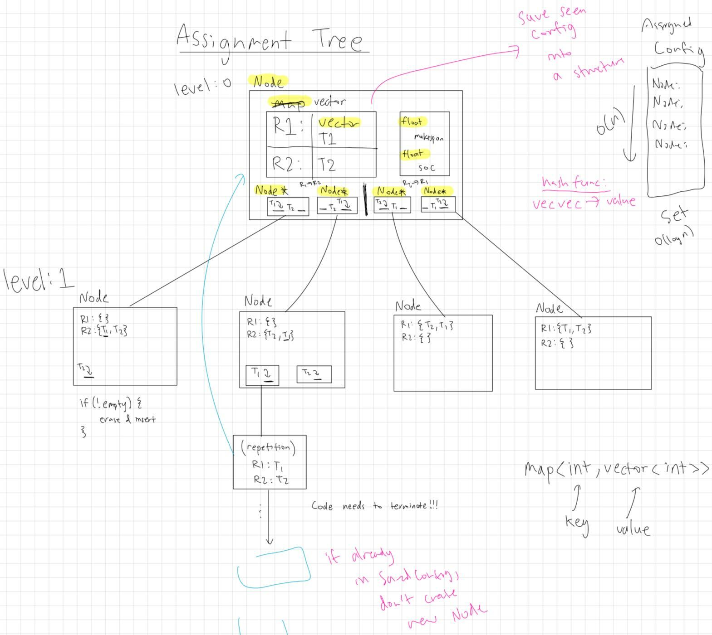
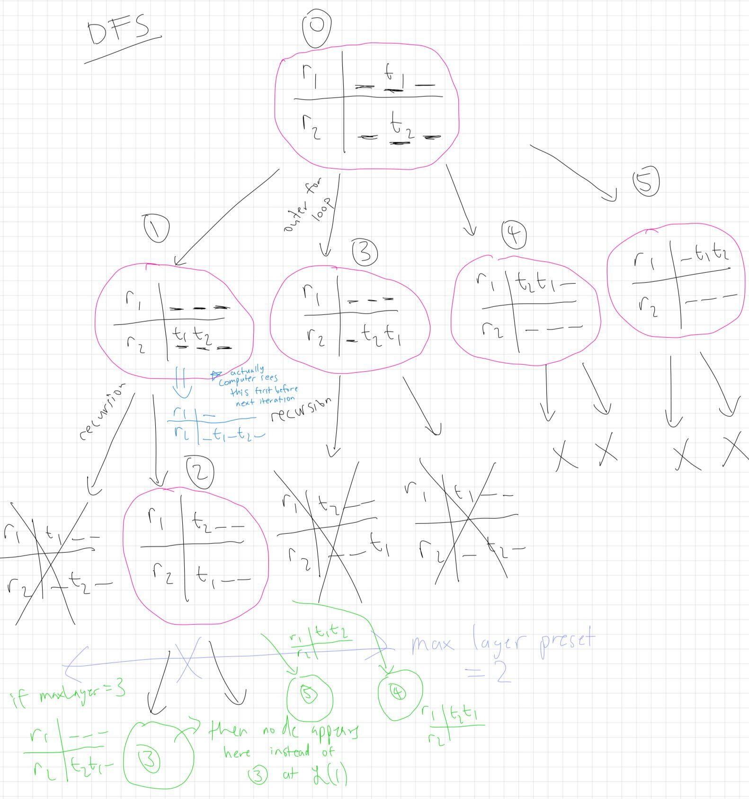
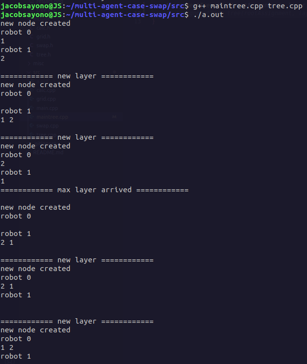
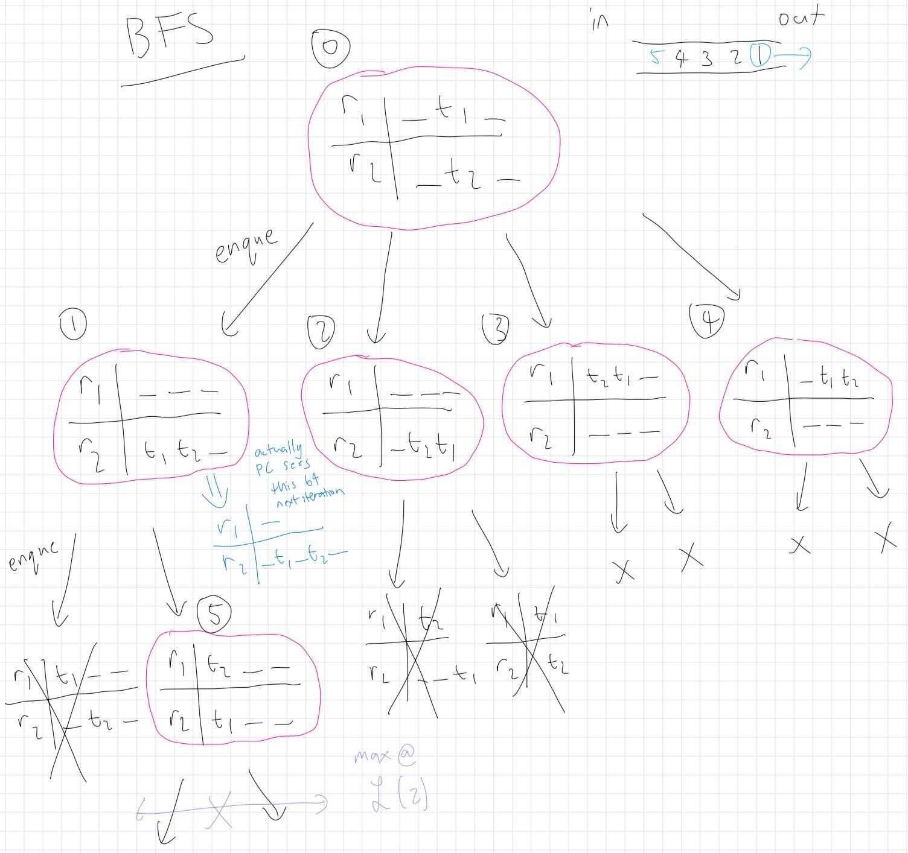
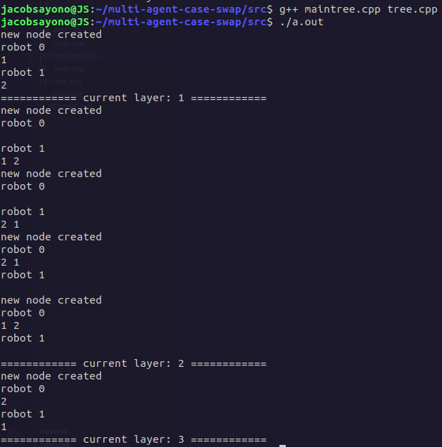
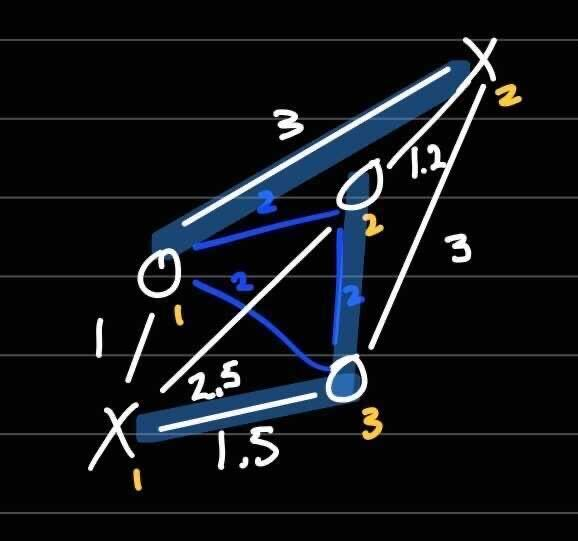
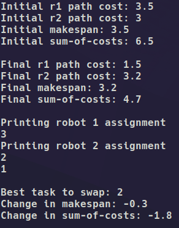
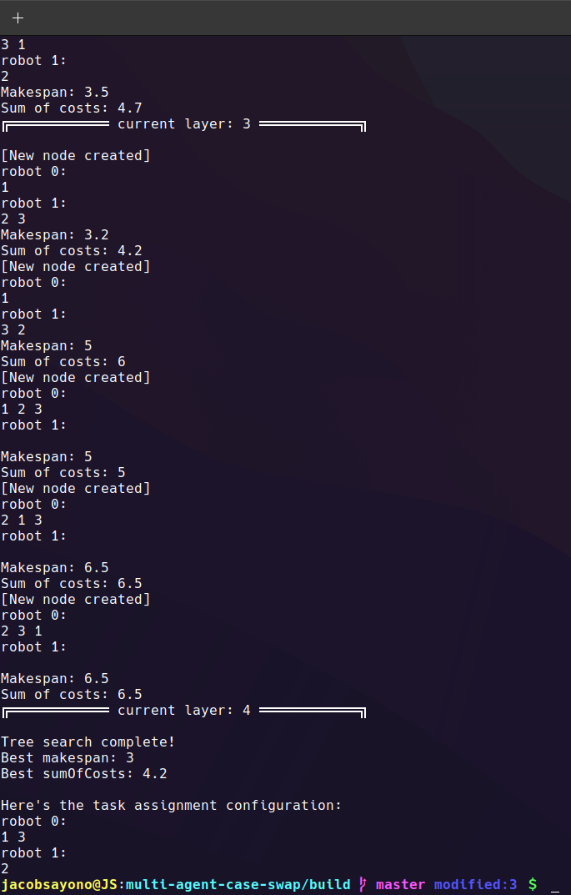

# Multi-Agent Case Swap

## Build using CMake.
```
git clone https://github.com/jacobsayono/multi-agent-case-swap.git
cd multi-agent-case-swap
mkdir build
cd build
cmake ..
cmake --build .
./brute
```

## Tree class.










## Example using 3 robots (X), 2 tasks (O) with cost from each robot to each task.



Results for best 1-swap:



Results for best k-swap using tree structure:



## Example using recursive k-swap for grid implementation with (x, y) coordinates.


## Core functions.

- `one_swap()` searches through all possible one-swaps between two robots and returns the best one.

- `k_swap()` uses one-swap recursively to test all k-number of swaps (depth value).

- `add_task()` simulates an online task assignment that generates a random cost matrix to this new task. (TODO)

- `heuristic()` uses euclidean properties to find potential tasks that can be swapped. (TODO)

## Tree class.

The tree class builds a tree of nodes. Each node consists of a task assignment configuration, including its makespan and sum of costs. Additionally, the node dynamically allocates new memory to create a layer of children nodes, pointing to their respective addresses in memory. Each layer of the tree represents the depth in which we do k-swaps. The explored task assignment configuration is stored in a hash table to prevent duplicates and allowing the algorithm to terminate.

The goal is to form a DFS/BFS heuristic using a mathematical hypothesis that hints at us in approaching a lower bound on makespan. The first step is to use a brute-force approach to keep track of the minimum makespan as we traverse the tree.

##### Bug fixes & further implementation:
- ~~TODO: fix arr output so that it stores best task to swap for every recursive step~~

- ~~TODO: recurse the recursion checks for n robots~~

- TODO: implement add_task() online using argc and argv

- TODO: implement multiple heuristic() functions and measure their optimality

##### Secondary features:
- TODO: make robot and task position initialization input from txt file.

- TODO: use map generation (with walls) as environment and djikstra's algorithm to find cost matrix to each task.
