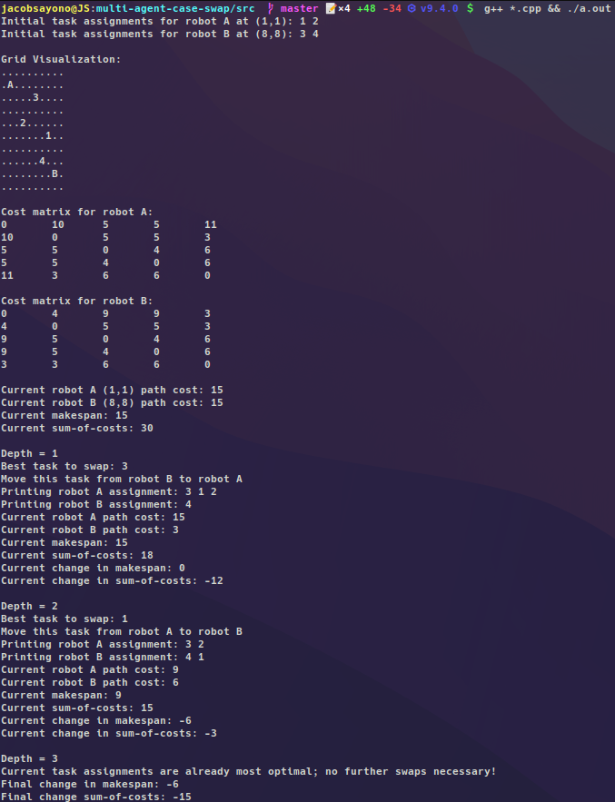

# Multi-Agent Case Swap

## Example using 3 robots (X), 2 tasks (O) with cost from each robot to each task.

Results for best 1-swap:

## Example using recursive k-swap for grid implementation with (x, y) coordinates.

## Core functions.

- `one_swap()` searches through all possible one-swaps between two robots and returns the best one.

- `k_swap()` uses one-swap recursively to test all k-number of swaps (depth value).

- `add_task()` simulates an online task assignment that generates a random cost matrix to this new task. (TODO)

- `heuristic()` uses euclidean properties to find potential tasks that can be swapped. (TODO)

##### Bug fixes & further implementation:
- ~~TODO: fix arr output so that it stores best task to swap for every recursive step~~

- TODO: recurse the recursion checks for n robots

- TODO: implement add_task() online using argc and argv

- TODO: implement heuristic() and measure optimality

##### Secondary features:
- TODO: make robot and task position initialization input from txt file.

- TODO: use map generation (with walls) as environment and djikstra's algorithm to find cost matrix to each task.
